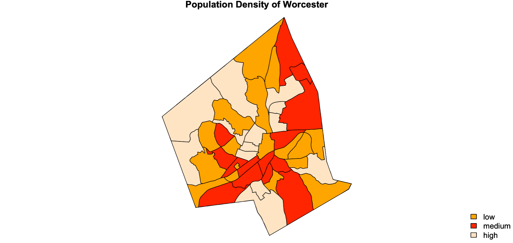
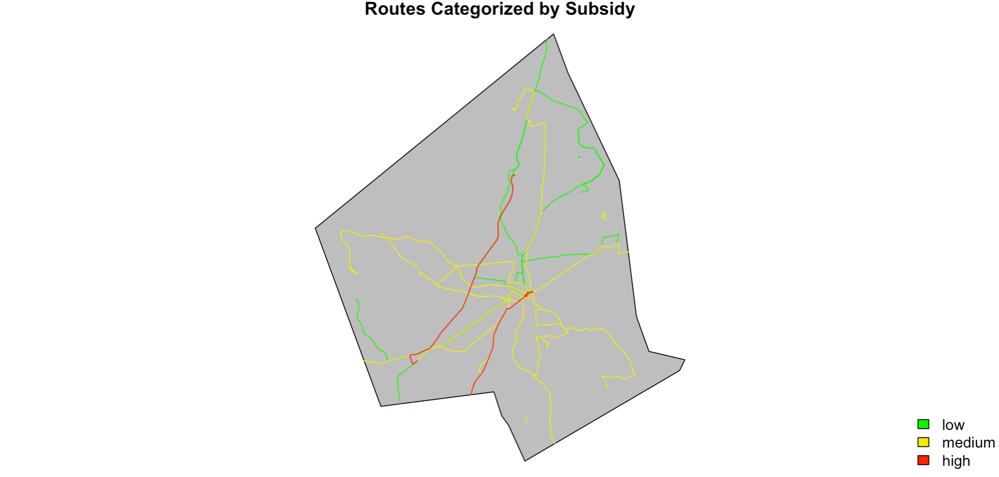
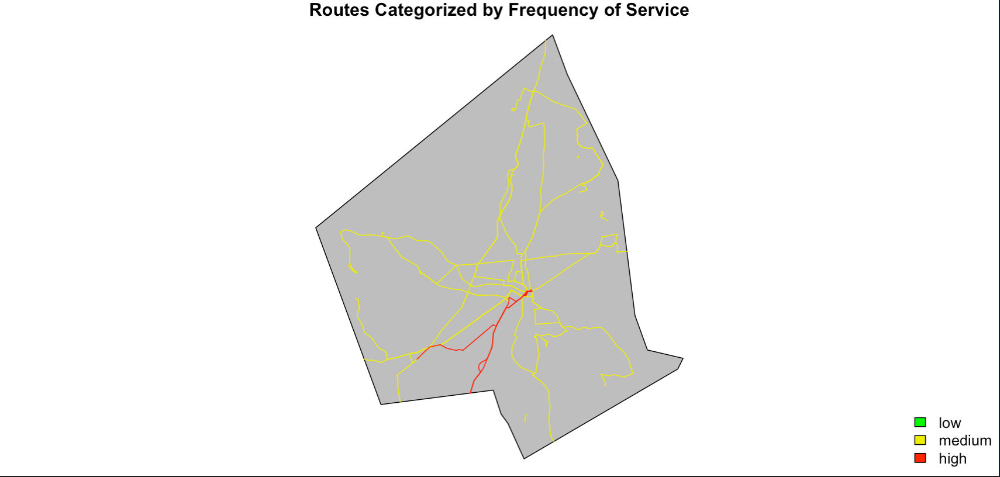
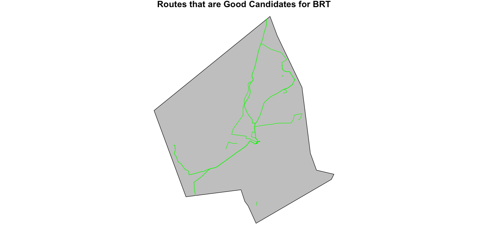
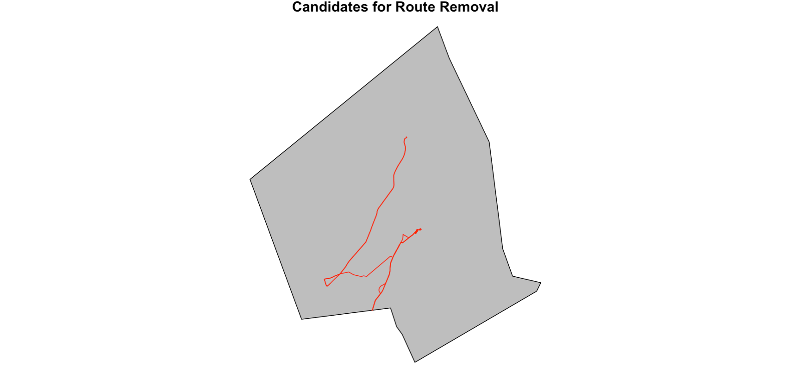

```{r setup,include = FALSE}
knitr::opts_chunk$set(echo = FALSE)
```

## Introduction

WRTA route and stop configuration is selected in a manual manner. Route configuration
could benefit from both simple geoprocessing and complex modeling that R is capable of.

By using geospatial analysis in R, we hope to identify routes that appear to have 
a disproportionate amount of resources and routes which could benefit from
increased revenue.

We hope that this project and subsequent thesis will be used to the benefit
of Worcester's citizenry.


## Data

The vast majority of our data is derived from WRTA reports, TIGER shapefiles, and 
census data. Some examples can be seen below.


```{r,error = TRUE, echo = FALSE, message = FALSE, error = TRUE, comments = "."}
library(raster)
library(geospaar)
library(sf)
library(wrta)

roads <- system.file("extdata/tl_2018_25027_roads/tl_2018_25027_roads.shp",
                     package = "wrta") %>% st_read() 

stops <- system.file("extdata/WRTA_August_2020/Active_WRTA_Bus_Stops_Aug2020.shp",
                     package = "wrta") %>% st_read()

routes <- system.file("extdata/WRTA_August_2020/Active_WRTA_Routes_Aug2020.shp",
                      package = "wrta") %>% st_read() %>% st_zm()

worcester <- system.file("extdata/Worcester/worcester.shp",
                     package = "wrta") %>% st_read()

```


## Methods

Our methodology is fairly straight forward. We have six deliverables, designed as 
as follows:

- Population Density Map (Read in data --> Display)
- Car Density Map (Read in data --> Display)
- Categorization of Ridership Map (Preprocess --> Read In --> Join with Line Data --> Create categories --> Display)
- Routes above maximum subsidy (Preprocess --> Read In --> Join with Line Data --> Create Categories --> Display)
- Route Headway (Preprocess --> Read In --> Join with Line Data --> Create Categories --> Display)
- BRT- Display lowest subsidy and highest ridership routes
- Closure- Display highest subsidy, lowest ridership, and longest time taken

## Results - Population Density
When making assessments and configuring bus routes population density is a critical 
portion of the analyis. Prioritizing areas that have heavy populations, means better
service for more people. 

```{r, echo = FALSE, eval = FALSE}

par(mar = c(0, 0, 1, 0)) 
plot(x = pop_density_subset %>% st_geometry(),  col = c("orange", "red", "bisque"))
title(main = "Population Density of Worcester")
legend(x = "bottomright", legend = c("low", "medium", "high"), 
       fill = c("orange", "red", "bisque"), bty = "n")

```

```{r, fig.align ='center', out.width = "90%"}




```


## Results- Vehicle Density

Similar to population density, vehicle ownership is an important factor to consider
when planning a bus system.  70% of WRTA riders don't own a car! In Garren's other GIS
class, a basic suitability index (income, population, and car ownership), revealed that there were 13,000 "missing bus riders" along route 27, which only gets 1,000 riders a day.
```{r, echo = FALSE, eval = FALSE}
par(mar = c(0, 0, 1, 0)) 
plot(vehicle_density_subset %>% st_geometry(), col = c("green", "blue", "aquamarine"))
title(main = "Vehicle Density of Worcester")
legend(x = "bottomright", legend = c("low", "medium", "high"), 
       fill = c("green", "blue", "aquamarine"), bty = "n")
```


```{r, fig.align ='center', out.width = "80%"}

knitr::include_graphics("figures/vehicle_dense.png")
```

## Results - Ridership
This map showcases ridership. While the categories are somewhat arbitrary, we
tried to simulate a Natural Jenks Break in the data. So low ridership is below 10k
weekday riders per annum, medium ridership is between 10k and 170k riders per annum,
and high ridership is anything above 170k riders per annum.

```{r, echo = FALSE,eval = FALSE}
par(mar = c(0, 0, 1, 0))
plot(worcester %>% st_geometry(), col = "grey")
plot(distinct_route_filter_low %>% st_geometry(), col = "red", add = TRUE)
plot(distinct_route_filter_medium %>% st_geometry(), col = "yellow", add = TRUE)
plot(distinct_route_filter_high %>% st_geometry(), col = "green", add = TRUE)
title(main = "Routes Categorized by Ridership")
legend(x = "bottomright", legend = c("low", "medium", "high"), 
       fill = c("red", "yellow2", "green"), bty = "n")
```


```{r, fig.align= 'center', out.width = "80%"}

knitr::include_graphics("figures/Ridership_cat.png")

```

## Results - Subsidy
This map showcases subsidy. While there was a lot of literature on this, nothing
quite worked with Worcester. So this map displays subsidy above and below the system average of 3 dollars, and had a high category for outliers above ten dollars. 

- Folks who take the Park Avenue Connector may be paying a buck seventy five, but it costs a whopping 28 dollars per person!

```{r, echo= FALSE, eval = FALSE}
par(mar = c(0, 0, 1, 0))
plot(worcester %>% st_geometry(), col = "grey")
plot(subsidy_route_filter_low %>% st_geometry(), col = "green", add = TRUE)
plot(subsidy_route_filter_medium %>% st_geometry(), col = "yellow2", add = TRUE)
plot(subsidy_route_filter_high %>% st_geometry(), col = "red", add = TRUE)
title(main = "Routes Categorized by Subsidy")
legend(x = "bottomright", legend = c("low", "medium", "high"), 
       fill = c("green", "yellow2", "red"), bty = "n")
```


```{r, fig.align ='center', out.width = "75%" }



```

## Results - Frequency
This map showcases frequency of service. No bus comes by less than every half hour, 
most come between every half hour and hour, and a few come by every TWO HOURS. Imagine
planning your day around that!

```{r, eval = FALSE, echo = FALSE}
par(mar = c(0, 0, 1, 0))
plot(worcester %>% st_geometry(), col = "grey")
plot(headways_route_filter_low %>% st_geometry(), col = "green", add = TRUE)
plot(headways_route_filter_medium %>% st_geometry(), col = "yellow2", add = TRUE)
plot(headways_route_filter_high %>% st_geometry(), col = "red", add = TRUE)
title(main = "Routes Categorized by Frequency of Service")
legend(x = "bottomright", legend = c("low", "medium", "high"), 
       fill = c("green", "yellow2", "red"), bty = "n")
```


```{r, fig.align ='center', out.width = "90%"}


```


## Results - Bus Rapid Transit
Routes 27, 26, and 19 are good candidates for increased funding.

```{r, echo = FALSE, eval = FALSE}
par(mar = c(0, 0, 1, 0))
plot(worcester %>% st_geometry(), col = "grey")
plot(subsidy_route_filter_low %>% st_geometry(), col = "green", add = TRUE)
plot(distinct_route_filter_high %>% st_geometry(), col = "green", add = TRUE)
title("Routes that are Good Candidates for BRT")

```


```{r, fig.align ='center', out.width = "100%"}



```

## Results - Closure

Accoriding to our analysis, these routes should bec considered for closure. The top three
are routes 8, 29 and 22.

```{r,echo = FALSE,eval = FALSE}
par(mar = c(0, 0, 1, 0))
plot(worcester %>% st_geometry(), col = "grey")
plot(headways_route_filter_high %>% st_geometry(), col = "red", add = TRUE)
plot(subsidy_route_filter_high %>% st_geometry(), col = "red", add = TRUE)
plot(distinct_route_filter_low %>% st_geometry(), col = "red", add = TRUE)
title("Candidates for Route Removal")
```

```{r, fig.align ='center', out.width = "100%" }




```

## Looking Forward

Further analysis and modeling using packages like zoo lpsolve will be completed in the coming months. We look forward to sharing these findings as they emerge! 


