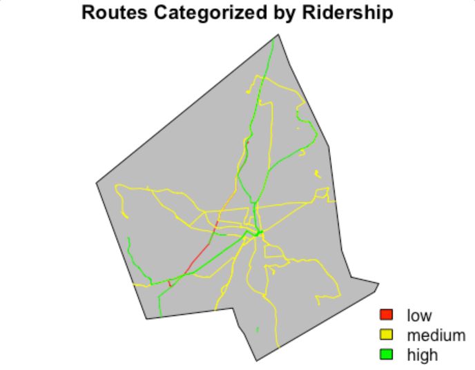

```{r setup,include = FALSE}
knitr::opts_chunk$set(echo = FALSE)
```

## Introduction

WRTA route and stop configuration is selected in a manual manner. Route configuration
could benefit from both simple geoprocessing and complex modeling that R is capable of.

By using geospatial analysis in R, we hope to identify routes that appear to have 
a disproportionate amount of resources and routes which could benefit from
increased revenue.

We hope that this project and subsequent thesis will be used to the benefit
of Worcester's citizenry.


## Data

The vast majority of our data is derived from WRTA reports, TIGER shapefiles, and 
census data. Some examples can be seen below.


```{r,error = TRUE, echo = FALSE, message = FALSE, error = TRUE, comments = "."}
library(raster)
library(geospaar)
library(sf)
library(wrta)

roads <- system.file("extdata/tl_2018_25027_roads/tl_2018_25027_roads.shp",
                     package = "wrta") %>% st_read() %>% head()

stops <- system.file("extdata/WRTA_August_2020/Active_WRTA_Bus_Stops_Aug2020.shp",
                     package = "wrta") %>% st_read()

routes <- system.file("extdata/WRTA_August_2020/Active_WRTA_Routes_Aug2020.shp",
                      package = "wrta") %>% st_read() %>% st_zm()

worcester <- system.file("extdata/Worcester/worcester.shp",
                     package = "wrta") %>% st_read()

```


```{r, echo = FALSE}
library(rasterVis)

png("inst/external/figs/Subsidy.png", bg = "transparent", height = 4, 
    width = 3, res = 300, units = "in")
dev.off

```


## Methods

Our methodology is fairly straight forward. We have six deliverables, designed as 
as follows:

- Population Density Map (Read in data --> Display)
- Traffic Count Map (Read in --> Display)
- Categorization of Ridership Map (Preprocess --> Read In --> Join with Line Data --> Create categories --> Display)
- Routes above maximum subsidy (Preprocess --> Read In --> Join with Line Data --> Create Categories --> Display)
- Route Headway (Preprocess --> Read In --> Join with Line Data --> Create Categories --> Display)
- BRT- Display lowest subsidy and highest ridership routes
- Closure- Display highest subsidy, lowest ridership, and longest time taken


## Results

We found that there are many inefficiencies in the WRTA as displayed below:

```{r, fig.align='left'}



```

## Resullts Cont.
By assessing traffic count, where ridership is already high, and where there are 
dense populations in Worcester one can come to make recommendations.


```{r}

```

## Conclusion

By looking at the above data we recommend cutting the ___ lines and adding those resources to the ____lines. In doing so, the system better serves the Worcester populace. 

For example, leaning on analysis completed for another course,  upwards of 48,000 residents would benefit from more service on Route 27 with 13,000 of those resident fitting the profile of a typical WRTA user.

Further analysis and modeling using packages like zoo lpsolve will be completed in the coming months. We look forward to sharing these findings as they emerge. 
and 


