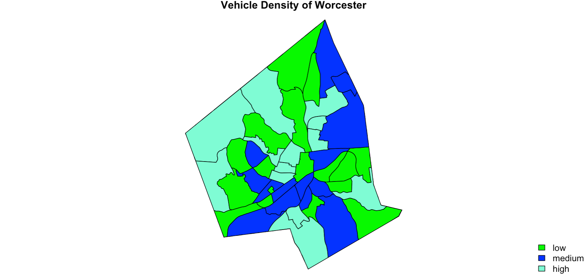
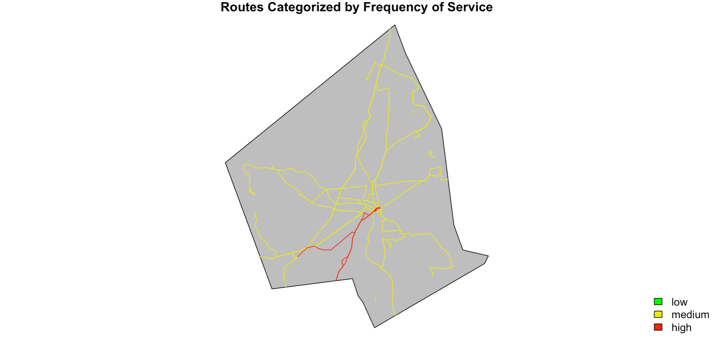

```{r, include = FALSE}
knitr::opts_chunk$set(
  collapse = TRUE,
  comment = "#>"
)
```

```{r setup}
library(wrta)
library(sf)
library(dplyr)
library(rgdal)
library(geospaar)
```

# Overview

This project written by Garren Kalter and Luke Watson-Sharer showcases some of the inefficiencies in the Worcester Regional Transit Authority. In doing so, we hope to use our geospatial and coding skills in order to propose potential improvements to the WRTA. While this package will continue to be built well into the Spring of 2021, for the purposes of Geography 346 we will display various deliverables with an end goal of highlighting routes that are good candidates for increased service and those that could benefit from closure. 

Additionally,  we will be operating with the constraint that the WRTA budget remains unchanged as many suggestions we have, have already been proposed. The caveat being that those proposal cost millions more than the WRTA operating budget and subsequently have not been adopted.


# Approach and Methods

## Data

The data used in this report come from a variety of locations. Data sources of note include the Worcester Regional Transit Authority, the census, and MassGIS. It should be known that data from the WRTA website has been manipulated and preprocessed in order to be readible for the R program. Relevant data sources are shown below, read in. 

```{r}


ridership <- system.file("extdata/Weekday_ridership.xlsx", package = "wrta") %>% 
  readxl::read_excel() 

county <- system.file("extdata/tl_2017_25027_faces/tl_2017_25027_faces.shp",
                     package = "wrta") %>% st_read()

roads <- system.file("extdata/tl_2018_25027_roads/tl_2018_25027_roads.shp",
                     package = "wrta") %>% st_read()

stops <- system.file("extdata/WRTA_August_2020/Active_WRTA_Bus_Stops_Aug2020.shp",
                     package = "wrta") %>% st_read()
routes <- system.file("extdata/WRTA_August_2020/Active_WRTA_Routes_Aug2020.shp",
                      package = "wrta") %>% st_read() %>% st_zm()
worcester <- system.file("extdata/Worcester/worcester.shp",
                     package = "wrta") %>% st_read()
census_poly<- system.file("extdata/Census/export-gisdata.mapc.census2010_tracts_poly.shp",          
                          package = "wrta") %>% st_read()

vehicle <- system.file("extdata/tabular.trans_mavc_public_summary_ct_2014_q4.csv", 
                       package = "wrta") %>% readr::read_csv(.)

census_pop <- system.file("extdata/tabular.demo_general_demographics_ct_2010.csv",
                          package = "wrta") %>% readr::read_csv(.)

worcester <- system.file("extdata/Worcester/worcester.shp",
                     package = "wrta") %>% st_read()

```


## Code
At this point in time, we do not have any deliverables which will require a package outside of those we have already been exposed to in Geog346. Packages which will be used include: devtools, geospaar, dplyr, ggplot,roxgen2, sp, sf, tibble, and tidyverse among others. Future packages will include complex modeling and deliverables using packages like zoo or lpSolve package. However, this likely will not be done until the winter.

## Methods

We broke this project in to two components. Assessing the relevant background information of the WRTA and an assesstment of the characteristics of WRTA routes.

### Demographic Information

Here we wanted to understand the density of cars and people in Worcester. In other bus systems, such as Madison, WI indexes based off income, density, and car ownership, have been deployed successfully in order to assess route need. While, we have yet to reach indexing, we were able to create a display of population and vehicular density. We read the relevant data in from the census, reprojected it, and cleaned it in order to cut it to Worcester. Finally we added relevant fields and plotted it. Additional information can be found on the Luke Vignette.


### Characteristics of Bus Routes

Here we created deliverables for three different characteristics: the amount of riders on a route (ridership), how often the route comes by (frequency), and how much the route is subsidized by the government(subsidy). 

The methodology in these maps was basically identical. We preproccessed data from the 2015 
Regional Transit Plan to determine the aforementioned characteristic values for each route. We then joined this data to a shapefile of WRTA routes and cut out routes that didn't have data or were outside Worcester. We then created a mutation that categorized these characteristics as either  high, medium, or low.  But due to routes running on the same roads only the top route would display in the map. In order to overcome this, we made new objects using subset() in order to seperate ridership, subsidy, and frequency by category.
We then plotted these subsetted values. More information, such as specific category breakdown, can be found in the Garren vignette.

## Findings

We also created deliverables suggesting where additional resources would be useful. The methodology deployed was pretty brute. We simply put the worst and best categories on maps, comparing the trends against the basic demograhic maps. We recognize that future versions of this package and its subsequent modeling will require more sophisticated methodologies. 


# Results -Worked Example

The following section goes into detail about some of our outputs and what those results mean for our analysis. 

## Ridership Table

We felt it important to highlight the preprocessed data we gathered from the Regional Transit Plan. These findings are the base of our model and highlight pretty startling discrepancies in use across the system. For example, why is aggregrate weekday ridership on route 8 less than 1,000 people for the entire fiscal year.

```{r}
ridership
```

## Vehicle Density Map

The below map is a vehicle density map, which showcases and categorizes the total inventory of vehicles per census tract. This is particularly important as approximately 70% of WRTA users do not own a car. Given that census tracts are fairly small, and the scale of analysis is per sq mile, the  vehicular density is also fairly low. However, one can clearly discern that areas that are more populated appear to have a higher density of vehicles.

```{r, out.width = "70%", fig.align = 'center', echo = FALSE}

```

## Subsidy Map

The below map is the subsidies map. While all routes recieve subsidy the range is fairly broad, anywhere from two dollars per rider to 26 dollars per rider. The color scheme of the map below is categorized as follows. A low rate shows fares below the system average of three dollars, medium is above average, and a high categorization is 10 dollars per rider. Additionally, while, there is a correlation between high ridership and low subsidy levels this relationship does not always hold up. By identifying routes that for one reason or another require additional subsidy compared to others we can begin to implement strategic budgetary improvements for the system and send dollars where additional riders are.  For example, route 29 has moderate levels of ridership around 55,000 people, but has a subsidy of 19 dollars per person. 


```{r, out.width = "70%", fig.align = 'center', echo = FALSE}
knitr::include_graphics("figures/subs_final.png")
```

## Frequency Map

The frequency map, highlights some of the more absurd components of the WRTA system. While there is no route that runs more often than every half hour, there are multiple routes which run every two hours. With on time rates between 80 and 90% further analysis of these infrequent routes is warranted. For example, many of these routes go to and from Worcester's suburbs. Per a phone interview with operators in the WRTA, these suburban routes are the only ones with peak ridership for commuting with 40% of WRTA ridership currently uses the system for commuting. These routes seems like an optimal growth scenario, as it is reasonable to assume few people are voluntarily tying their timeliness to work on routes that, if they miss the bus, will make them 2 hours late. 

```{r, out.width = "70%", fig.align = 'center', echo = FALSE}

```

## Bus Rapid Transit Map

This our final map. There isn't much to say about it yet as the model is pretty rudimentary as highlighted above. Ultimately this map is our best guess so far as to where to push additional funding. The top three routes found here are the 27, 26, and 19. Which is affirming to our methodology as that reflects well on previous recommendations for additional funding.

```{r, out.width = "70%", fig.align = 'center', echo = FALSE}
knitr::include_graphics("figures/brt_final.png")
```

# Discussion 


For clarities sake our discussion section will mirror the results section. While there are other factors and figures to consider more information can be found in the accompanying vignettes.

## Density Map

The below map is a vehicle density map, which showcases and categories the total inventory of vehicles per census tract. This is particurly important as approximately 70% of WRTA users do not own a car. Thus, high levels of vehicular ownership could potentially correspond to low levels of ridership.  An overarching component of Garren's thesis involves the idea of "missing riders", or riders who are otherwise good candidates for the WRTA but choose not to take it anyway. A prime example  of this from Garren's project in Advanced Vector, is that 14,000 people without cars live within a 15 minutes walk of Route 27, the city's "best route" yet only 1 to 2 thousand people take it every day. Thus suggesting that service is not good enough and potentially tens of thousands of residents are experiencing limited mobility scenarios.

```{r, out.width = "70%", fig.align = 'center', echo = FALSE}

```

## Subsidy Map

The below map is the subsidies map. This shows us the amount that is spent by the public in order to subsidize riding the system. We became curious about this after discovering that only about 1 in 5 operating dollars of the WRTA are made through fares and 5% of the budget is spent on fare infrastructure maintenance. Thus, fares only net about 15% of the budget.  While there aren't too many routes with high subsidies, the routes that do, appear to be significantly more expensive to operate than they are worth. Every person that takes the 8, for example, costs the public 26 dollars. Devoting an entire bus to this line, when very few are taking it, and it has high overhead leads us to suggest a reallocation of the 8's resources.

```{r, out.width = "70%", fig.align = 'center', echo = FALSE}
knitr::include_graphics("figures/subs_final.png")
```

## Frequency Map

Continuing on that, we found that even the best lines don't run all that often, with no routes running more frequently than every half hour. This supports the idea that there is a large segment of the residential population who would benefit from increased service. According to the literature, people will take whichever means of transportation gets them to their destination quickest.  By having slow transit as the standard, most people will simply never take the WRTA unless they either have no choice in the manner or they are choicing consciously to take pub lic transportation.

```{r, out.width = "70%", fig.align = 'center', echo = FALSE}

```

## Bus Rapid Transit Map

A continuation of this idea of fast routes is installing a bus rapid transit system where demand is highest. Ideally the bus would come every 7 to 15 minutes or in otherwords frequently enough that in general a timetable is unnessecary.  While our model for this is still pretty rudimentary, the below picture is the amolgomation of our other results and is our suggestion for which routes would make good candidates for this additional resourcing. As mentioned above, we found that the top three routes were the 27, 26, and 19. Which is inline with previous recommendations for bus rapid transit in the Worcester area. 

```{r, out.width = "70%", fig.align = 'center', echo = FALSE}
knitr::include_graphics("figures/brt_final.png")
```


## Looking Forward
There are many promising opportunities looking forwards. We have identified some promising packages that we hope to use to start creating optimization models.  While we clearly had some struggles, for example joining our information to datasets and maintaining its geometry, we are very excited to see where it goes. Additionally, Garren is spending this winter going back to the drawing board, hopefully getting input from new data science fields like operations research, and working to make this model comprehensive and usable to better aid the city of Worcester. We can't wait to show you in the Spring! 


